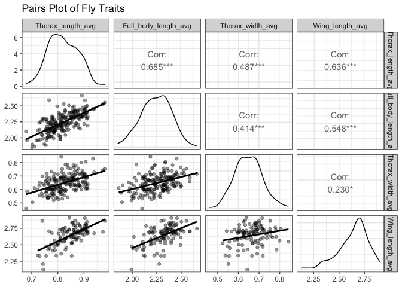
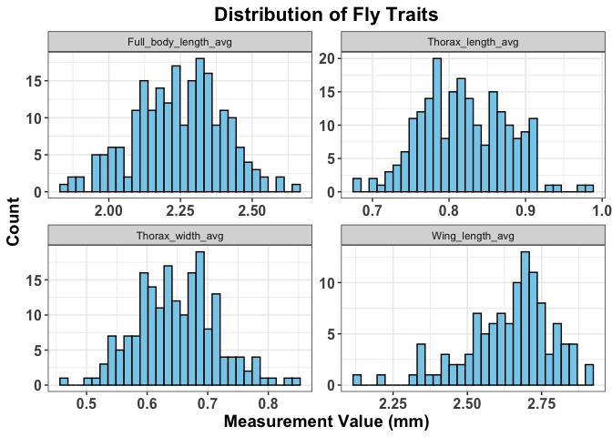
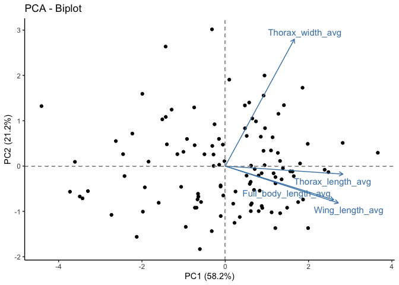
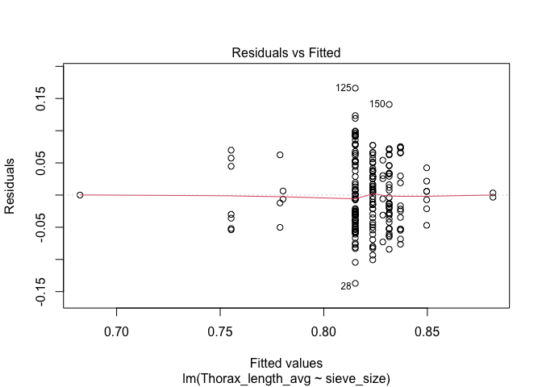
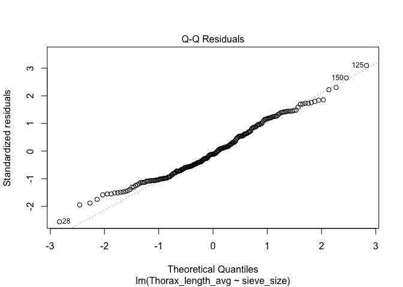
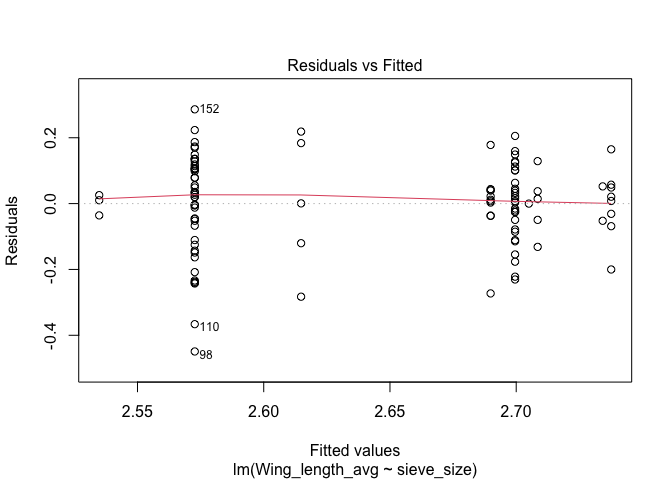
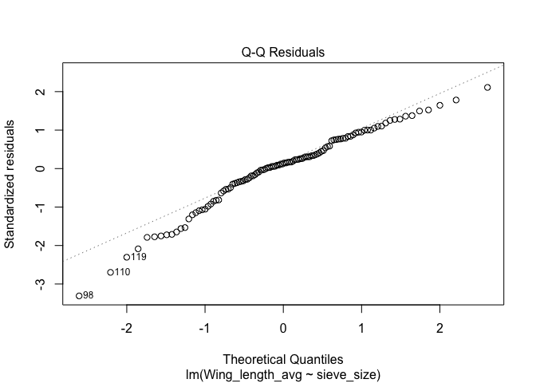
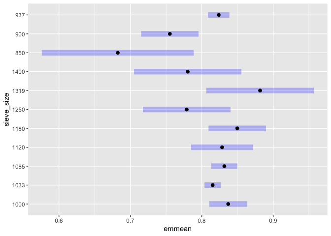
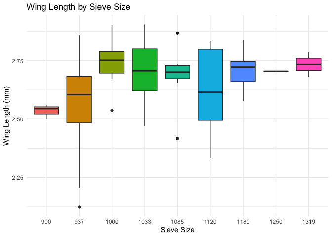
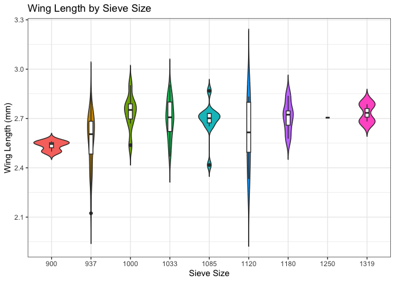

Measurements_analysis
================
Siraj
2025-03-17

# Phenotypic data preparation

We start with our data stored in the following csv files:

``` bash
cd /Users/selmasri/projects/trunc_sel_ee/data/phenotypic/raw
ls *.csv
```

    ## E&R_Phenotypic_Data_D.sim - phenotype_data.csv
    ## Thorax_measurments - Variance_estimation.csv
    ## Thorax_measurments.csv
    ## Thorax_measurments_Variance_estimation2days.csv

Setting working directory

``` r
setwd("/Users/selmasri/projects/trunc_sel_ee/data/phenotypic/raw")
```

Next, I process the data, having and I calculate the mean for the the
several measurments of the trait by summarizing the several rows
corresponding to the fly id and trait

# loading the data

``` r
library(emmeans)
```

    ## Welcome to emmeans.
    ## Caution: You lose important information if you filter this package's results.
    ## See '? untidy'

``` r
library(factoextra)
```

    ## Loading required package: ggplot2

    ## Welcome! Want to learn more? See two factoextra-related books at https://goo.gl/ve3WBa

``` r
library(corrplot)
```

    ## corrplot 0.95 loaded

``` r
library(psych)
```

    ## 
    ## Attaching package: 'psych'

    ## The following objects are masked from 'package:ggplot2':
    ## 
    ##     %+%, alpha

``` r
library(dplyr)
```

    ## 
    ## Attaching package: 'dplyr'

    ## The following objects are masked from 'package:stats':
    ## 
    ##     filter, lag

    ## The following objects are masked from 'package:base':
    ## 
    ##     intersect, setdiff, setequal, union

``` r
library(ggplot2)
library(car)
```

    ## Loading required package: carData

    ## 
    ## Attaching package: 'car'

    ## The following object is masked from 'package:dplyr':
    ## 
    ##     recode

    ## The following object is masked from 'package:psych':
    ## 
    ##     logit

``` r
library(tidyr)
library(dplyr)
library(GGally)
```

    ## Registered S3 method overwritten by 'GGally':
    ##   method from   
    ##   +.gg   ggplot2

    ## 
    ## Attaching package: 'GGally'

    ## The following object is masked from 'package:emmeans':
    ## 
    ##     pigs

``` r
library(lmtest)
```

    ## Loading required package: zoo

    ## 
    ## Attaching package: 'zoo'

    ## The following objects are masked from 'package:base':
    ## 
    ##     as.Date, as.Date.numeric

``` r
main_df <- read.csv("Thorax_measurments.csv", header =  TRUE, sep = ",")
str(main_df)
```

    ## 'data.frame':    645 obs. of  6 variables:
    ##  $ Fly_ID              : chr  "fly_0001" "fly_0001" "fly_0001" "fly_0002" ...
    ##  $ Date_measured       : chr  "20/01/2025" "20/01/2025" "20/01/2025" "21/01/2025" ...
    ##  $ Thorax_length.mm.   : num  0.761 0.707 0.754 0.737 0.812 0.771 0.831 0.862 0.865 0.77 ...
    ##  $ Full_body_length.mm.: num  2.02 2 2.11 2.25 2.26 ...
    ##  $ Thorax_width.mm.    : num  NA NA NA NA NA NA NA NA NA NA ...
    ##  $ wing.length.mm.     : num  NA NA NA NA NA NA NA NA NA NA ...

``` r
main_df$Date_measured <- as.Date(main_df$Date_measured, format = "%d/%m/%Y")
str(main_df)
```

    ## 'data.frame':    645 obs. of  6 variables:
    ##  $ Fly_ID              : chr  "fly_0001" "fly_0001" "fly_0001" "fly_0002" ...
    ##  $ Date_measured       : Date, format: "2025-01-20" "2025-01-20" ...
    ##  $ Thorax_length.mm.   : num  0.761 0.707 0.754 0.737 0.812 0.771 0.831 0.862 0.865 0.77 ...
    ##  $ Full_body_length.mm.: num  2.02 2 2.11 2.25 2.26 ...
    ##  $ Thorax_width.mm.    : num  NA NA NA NA NA NA NA NA NA NA ...
    ##  $ wing.length.mm.     : num  NA NA NA NA NA NA NA NA NA NA ...

``` r
# Aggregating replicate measurements by Fly_ID (and Date_measured if needed)
main_df_tidy <- main_df %>%
  group_by(Fly_ID, Date_measured) %>%
  summarise(
    Thorax_length_avg = mean(Thorax_length.mm., na.rm = TRUE),
    Full_body_length_avg = mean(Full_body_length.mm., na.rm = TRUE),
    Thorax_width_avg = mean(Thorax_width.mm., na.rm = TRUE),
    Wing_length_avg = mean(wing.length.mm., na.rm = TRUE)
  )
```

    ## `summarise()` has grouped output by 'Fly_ID'. You can override using the
    ## `.groups` argument.

Now there is another part of the data 28 flies present in other files
each fly has a .csv file(because of semi automation) i had to check all
these individual measurments (11 per fly) to see if they correspond to
the right trait since they are not labeled, now the code will average
the first 3 rows as thorax length then second 3 as body length etc

\##loading the 2nd set of data

``` r
# Path to the folder of individual CSVs
path <- "/Users/selmasri/Desktop/Project/measurments_results_gwas1"

# List all CSV files in that directory
files <- list.files(path, pattern = "\\.csv$", full.names = TRUE)

# A small helper function to parse Fly_ID from a filename like "fly_0189_results.csv"
get_fly_id <- function(filename) {
  base <- basename(filename)               # e.g. "fly_0189_results.csv"
  no_ext <- sub("\\.csv$", "", base)       # "fly_0189_results"
  fly_id <- sub("_results$", "", no_ext)   # "fly_0189"
  return(fly_id)
}

# A helper function that safely averages the "Length" column for a given set of row indices.
# If the file doesn't have enough rows, it returns NA.
get_mean <- function(df, idx, col = "Length") {
  if (all(idx <= nrow(df))) {
    mean(df[idx, col], na.rm = TRUE)
  } else {
    NA
  }
}

list_of_dfs <- lapply(files, function(file) {
  # 1) Parse the Fly_ID from the filename
  fly_id <- get_fly_id(file)
  
  # 2) Read the CSV
  df <- read.csv(file)
  
  # 3) For each trait, average the correct rows 
  thorax_length_avg   <- get_mean(df, 1:3,  "Length")
  body_length_avg     <- get_mean(df, 4:6,  "Length")
  thorax_width_avg    <- get_mean(df, 7:9,  "Length")
  wing_length_avg     <- get_mean(df, 10:11,"Length")  # may be NA if only 9 rows
  
  # 4) Create a single-row data frame with all traits
  out <- data.frame(
    Fly_ID             = fly_id,
    Date_measured      = as.Date("2025-01-27"),  # Hard-code this date
    Thorax_length_avg  = thorax_length_avg,
    Full_body_length_avg = body_length_avg,
    Thorax_width_avg   = thorax_width_avg,
    Wing_length_avg    = wing_length_avg
  )
  
  return(out)
})

# Combine all mini data frames for flies 188–215 into one
other_df <- bind_rows(list_of_dfs)

# Check the result
str(other_df)
```

    ## 'data.frame':    28 obs. of  6 variables:
    ##  $ Fly_ID              : chr  "fly_0188" "fly_0189" "fly_0190" "fly_0191" ...
    ##  $ Date_measured       : Date, format: "2025-01-27" "2025-01-27" ...
    ##  $ Thorax_length_avg   : num  0.877 0.819 0.809 0.908 0.82 ...
    ##  $ Full_body_length_avg: num  2.43 2.25 2.29 2.38 2.35 ...
    ##  $ Thorax_width_avg    : num  0.622 0.693 0.681 0.604 0.604 ...
    ##  $ Wing_length_avg     : num  2.71 NA 2.57 2.8 2.75 ...

``` r
head(other_df)
```

    ##     Fly_ID Date_measured Thorax_length_avg Full_body_length_avg
    ## 1 fly_0188    2025-01-27         0.8770000             2.428333
    ## 2 fly_0189    2025-01-27         0.8190000             2.247333
    ## 3 fly_0190    2025-01-27         0.8086667             2.285333
    ## 4 fly_0191    2025-01-27         0.9080000             2.382667
    ## 5 fly_0192    2025-01-27         0.8203333             2.347333
    ## 6 fly_0193    2025-01-27         0.8320000             2.123333
    ##   Thorax_width_avg Wing_length_avg
    ## 1        0.6223333          2.7120
    ## 2        0.6933333              NA
    ## 3        0.6810000          2.5670
    ## 4        0.6043333          2.8010
    ## 5        0.6043333          2.7455
    ## 6        0.6923333          2.4620

\##Merging the two dataframes

``` r
# 1) Remove flies 188 through 215 from the main data frame(note that original one had empty rows from 188 to 215)
#    Here, we're filtering out any Fly_ID that matches "fly_0188" through "fly_0215".
main_df_no_placeholders <- main_df_tidy %>%
  filter(
    !(Fly_ID %in% paste0("fly_0", 188:215))
  )

# 2) Stack the main data (with placeholders removed) and the other data
all_flies_df <- bind_rows(main_df_no_placeholders, other_df)

# 3) Inspect the final combined data
str(all_flies_df)
```

    ## gropd_df [215 × 6] (S3: grouped_df/tbl_df/tbl/data.frame)
    ##  $ Fly_ID              : chr [1:215] "fly_0001" "fly_0002" "fly_0003" "fly_0004" ...
    ##  $ Date_measured       : Date[1:215], format: "2025-01-20" "2025-01-21" ...
    ##  $ Thorax_length_avg   : num [1:215] 0.741 0.773 0.853 0.783 0.835 ...
    ##  $ Full_body_length_avg: num [1:215] 2.05 2.25 2.23 2.2 2.26 ...
    ##  $ Thorax_width_avg    : num [1:215] NaN NaN NaN NaN NaN NaN NaN NaN NaN NaN ...
    ##  $ Wing_length_avg     : num [1:215] NaN NaN NaN NaN NaN NaN NaN NaN NaN NaN ...
    ##  - attr(*, "groups")= tibble [215 × 2] (S3: tbl_df/tbl/data.frame)
    ##   ..$ Fly_ID: chr [1:215] "fly_0001" "fly_0002" "fly_0003" "fly_0004" ...
    ##   ..$ .rows : list<int> [1:215] 
    ##   .. ..$ : int 1
    ##   .. ..$ : int 2
    ##   .. ..$ : int 3
    ##   .. ..$ : int 4
    ##   .. ..$ : int 5
    ##   .. ..$ : int 6
    ##   .. ..$ : int 7
    ##   .. ..$ : int 8
    ##   .. ..$ : int 9
    ##   .. ..$ : int 10
    ##   .. ..$ : int 11
    ##   .. ..$ : int 12
    ##   .. ..$ : int 13
    ##   .. ..$ : int 14
    ##   .. ..$ : int 15
    ##   .. ..$ : int 16
    ##   .. ..$ : int 17
    ##   .. ..$ : int 18
    ##   .. ..$ : int 19
    ##   .. ..$ : int 20
    ##   .. ..$ : int 21
    ##   .. ..$ : int 22
    ##   .. ..$ : int 23
    ##   .. ..$ : int 24
    ##   .. ..$ : int 25
    ##   .. ..$ : int 26
    ##   .. ..$ : int 27
    ##   .. ..$ : int 28
    ##   .. ..$ : int 29
    ##   .. ..$ : int 30
    ##   .. ..$ : int 31
    ##   .. ..$ : int 32
    ##   .. ..$ : int 33
    ##   .. ..$ : int 34
    ##   .. ..$ : int 35
    ##   .. ..$ : int 36
    ##   .. ..$ : int 37
    ##   .. ..$ : int 38
    ##   .. ..$ : int 39
    ##   .. ..$ : int 40
    ##   .. ..$ : int 41
    ##   .. ..$ : int 42
    ##   .. ..$ : int 43
    ##   .. ..$ : int 44
    ##   .. ..$ : int 45
    ##   .. ..$ : int 46
    ##   .. ..$ : int 47
    ##   .. ..$ : int 48
    ##   .. ..$ : int 49
    ##   .. ..$ : int 50
    ##   .. ..$ : int 51
    ##   .. ..$ : int 52
    ##   .. ..$ : int 53
    ##   .. ..$ : int 54
    ##   .. ..$ : int 55
    ##   .. ..$ : int 56
    ##   .. ..$ : int 57
    ##   .. ..$ : int 58
    ##   .. ..$ : int 59
    ##   .. ..$ : int 60
    ##   .. ..$ : int 61
    ##   .. ..$ : int 62
    ##   .. ..$ : int 63
    ##   .. ..$ : int 64
    ##   .. ..$ : int 65
    ##   .. ..$ : int 66
    ##   .. ..$ : int 67
    ##   .. ..$ : int 68
    ##   .. ..$ : int 69
    ##   .. ..$ : int 70
    ##   .. ..$ : int 71
    ##   .. ..$ : int 72
    ##   .. ..$ : int 73
    ##   .. ..$ : int 74
    ##   .. ..$ : int 75
    ##   .. ..$ : int 76
    ##   .. ..$ : int 77
    ##   .. ..$ : int 78
    ##   .. ..$ : int 79
    ##   .. ..$ : int 80
    ##   .. ..$ : int 81
    ##   .. ..$ : int 82
    ##   .. ..$ : int 83
    ##   .. ..$ : int 84
    ##   .. ..$ : int 85
    ##   .. ..$ : int 86
    ##   .. ..$ : int 87
    ##   .. ..$ : int 88
    ##   .. ..$ : int 89
    ##   .. ..$ : int 90
    ##   .. ..$ : int 91
    ##   .. ..$ : int 92
    ##   .. ..$ : int 93
    ##   .. ..$ : int 94
    ##   .. ..$ : int 95
    ##   .. ..$ : int 96
    ##   .. ..$ : int 97
    ##   .. ..$ : int 98
    ##   .. ..$ : int 99
    ##   .. .. [list output truncated]
    ##   .. ..@ ptype: int(0) 
    ##   ..- attr(*, ".drop")= logi TRUE

``` r
head(all_flies_df)
```

    ## # A tibble: 6 × 6
    ## # Groups:   Fly_ID [6]
    ##   Fly_ID   Date_measured Thorax_length_avg Full_body_length_avg Thorax_width_avg
    ##   <chr>    <date>                    <dbl>                <dbl>            <dbl>
    ## 1 fly_0001 2025-01-20                0.741                 2.05              NaN
    ## 2 fly_0002 2025-01-21                0.773                 2.25              NaN
    ## 3 fly_0003 2025-01-21                0.853                 2.23              NaN
    ## 4 fly_0004 2025-01-21                0.783                 2.20              NaN
    ## 5 fly_0005 2025-01-21                0.835                 2.26              NaN
    ## 6 fly_0006 2025-01-21                0.804                 2.40              NaN
    ## # ℹ 1 more variable: Wing_length_avg <dbl>

\#Correlation between measurments

``` r
# ---- Correlation between measurments ----
##correlation between measurments
#creating a vector with column of interest
measure_cols <- c("Thorax_length_avg", "Full_body_length_avg", 
                  "Thorax_width_avg", "Wing_length_avg")
#subseting for columns of interest
sub_df <- all_flies_df[, measure_cols]

# Perform pairwise correlation with corr.test() storing in res_psych to use,
#the psych pacakge beacuse many rows have only two obersvations and some have 3 some have 4, and i dont want to omit any data
#bonferroni p value correction
res_psych <- corr.test(sub_df, use = "pairwise", method = "pearson", adjust = "bonferroni")

# View the results
res_psych$r   # Correlation matrix
```

    ##                      Thorax_length_avg Full_body_length_avg Thorax_width_avg
    ## Thorax_length_avg            1.0000000            0.6853894        0.4868249
    ## Full_body_length_avg         0.6853894            1.0000000        0.4143112
    ## Thorax_width_avg             0.4868249            0.4143112        1.0000000
    ## Wing_length_avg              0.6358692            0.5478186        0.2296589
    ##                      Wing_length_avg
    ## Thorax_length_avg          0.6358692
    ## Full_body_length_avg       0.5478186
    ## Thorax_width_avg           0.2296589
    ## Wing_length_avg            1.0000000

``` r
res_psych$n   # Number of observations used for each pair
```

    ##                      Thorax_length_avg Full_body_length_avg Thorax_width_avg
    ## Thorax_length_avg                  215                  215              190
    ## Full_body_length_avg               215                  215              190
    ## Thorax_width_avg                   190                  190              190
    ## Wing_length_avg                    111                  111              111
    ##                      Wing_length_avg
    ## Thorax_length_avg                111
    ## Full_body_length_avg             111
    ## Thorax_width_avg                 111
    ## Wing_length_avg                  111

``` r
res_psych$p   # p-values for each correlation
```

    ##                      Thorax_length_avg Full_body_length_avg Thorax_width_avg
    ## Thorax_length_avg         0.000000e+00         2.155942e-30     6.388172e-12
    ## Full_body_length_avg      3.593236e-31         0.000000e+00     1.685064e-08
    ## Thorax_width_avg          1.064695e-12         2.808439e-09     0.000000e+00
    ## Wing_length_avg           6.472974e-14         4.888558e-10     1.532024e-02
    ##                      Wing_length_avg
    ## Thorax_length_avg       3.883784e-13
    ## Full_body_length_avg    2.933135e-09
    ## Thorax_width_avg        9.192142e-02
    ## Wing_length_avg         0.000000e+00

``` r
summary(sub_df)
```

    ##  Thorax_length_avg Full_body_length_avg Thorax_width_avg Wing_length_avg
    ##  Min.   :0.6780    Min.   :1.850        Min.   :0.4590   Min.   :2.123  
    ##  1st Qu.:0.7782    1st Qu.:2.132        1st Qu.:0.6012   1st Qu.:2.564  
    ##  Median :0.8163    Median :2.242        Median :0.6473   Median :2.676  
    ##  Mean   :0.8201    Mean   :2.243        Mean   :0.6492   Mean   :2.640  
    ##  3rd Qu.:0.8632    3rd Qu.:2.348        3rd Qu.:0.6920   3rd Qu.:2.733  
    ##  Max.   :0.9813    Max.   :2.660        Max.   :0.8423   Max.   :2.905  
    ##                                         NA's   :25       NA's   :104

``` r
range(sub_df$Thorax_length_avg, na.rm = TRUE)
```

    ## [1] 0.6780000 0.9813333

``` r
range(sub_df$Thorax_width_avg, na.rm = TRUE)
```

    ## [1] 0.4590000 0.8423333

``` r
range(sub_df$Wing_length_avg, na.rm = TRUE)
```

    ## [1] 2.1235 2.9050

\###Visualizing using pairsplot

``` r
pairsplot <- ggpairs(sub_df,
                     # Lower panels: scatterplots with a linear smoothing line and transparent points
                     lower = list(continuous = wrap("smooth", method = "lm", se = FALSE, na.rm = TRUE, alpha = 0.4)),
                     # Diagonal panels: density plots or histograms
                     diag = list(continuous = "densityDiag"),
                     # Upper panels: display correlation coefficients using pairwise complete observations
                     upper = list(continuous = wrap("cor", use = "pairwise.complete.obs", method= "pearson")),
                     title = "Pairs Plot of Fly Traits"
) + theme_bw()

# Display the plot
pairsplot
```

    ## Warning: Removed 25 rows containing non-finite outside the scale range
    ## (`stat_smooth()`).
    ## Removed 25 rows containing non-finite outside the scale range
    ## (`stat_smooth()`).

    ## Warning: Removed 25 rows containing non-finite outside the scale range
    ## (`stat_density()`).

    ## Warning: Removed 104 rows containing non-finite outside the scale range
    ## (`stat_smooth()`).
    ## Removed 104 rows containing non-finite outside the scale range
    ## (`stat_smooth()`).
    ## Removed 104 rows containing non-finite outside the scale range
    ## (`stat_smooth()`).

    ## Warning: Removed 104 rows containing non-finite outside the scale range
    ## (`stat_density()`).

<!-- -->

``` r
# Save the plot to a file
ggsave(
  filename = "/Users/selmasri/projects/trunc_sel_ee/figs/pairsplotphenotypes.png",
  plot = pairsplot,
  width = 10,
  height = 10,
  units = "in"
)
```

    ## Warning: Removed 25 rows containing non-finite outside the scale range
    ## (`stat_smooth()`).

    ## Warning: Removed 25 rows containing non-finite outside the scale range
    ## (`stat_smooth()`).

    ## Warning: Removed 25 rows containing non-finite outside the scale range
    ## (`stat_density()`).

    ## Warning: Removed 104 rows containing non-finite outside the scale range
    ## (`stat_smooth()`).
    ## Removed 104 rows containing non-finite outside the scale range
    ## (`stat_smooth()`).
    ## Removed 104 rows containing non-finite outside the scale range
    ## (`stat_smooth()`).

    ## Warning: Removed 104 rows containing non-finite outside the scale range
    ## (`stat_density()`).

\##loading full fly information First I have to load a mapping file
which is file mapping the anonymous fly ID to the original ID which
contain the bin information. Then mearge it with the full data frame to
add the fly info

``` r
# load the mapping file 
mapping <- read.csv("/Users/selmasri/Desktop/Project/mapping.csv", stringsAsFactors = FALSE)

# Check the first rows
head(mapping)
```

    ##   Anonymized_ID        Original_File
    ## 1  fly_0001.tif B1_1033_01_06_07.tif
    ## 2  fly_0002.tif B1_1033_01_06_06.tif
    ## 3  fly_0003.tif B1_1033_01_06_04.tif
    ## 4  fly_0004.tif B1_1033_01_06_05.tif
    ## 5  fly_0005.tif B1_1033_01_06_01.tif
    ## 6  fly_0006.tif B1_1085_01_05_02.tif

``` r
### I will merge the data so i know later which fly has which id

# adding .tif extension to Fly_ID so the merging works
all_flies_df$Fly_ID <- ifelse(grepl("\\.tif$", all_flies_df$Fly_ID),
                              all_flies_df$Fly_ID,
                              paste0(all_flies_df$Fly_ID, ".tif"))

# merge the data 
merged_data <- merge(all_flies_df, mapping, 
                     by.x = "Fly_ID", by.y = "Anonymized_ID", 
                     all.x = TRUE)

# Check the merged data again
head(merged_data)
```

    ##         Fly_ID Date_measured Thorax_length_avg Full_body_length_avg
    ## 1 fly_0001.tif    2025-01-20         0.7406667             2.045667
    ## 2 fly_0002.tif    2025-01-21         0.7733333             2.249667
    ## 3 fly_0003.tif    2025-01-21         0.8526667             2.233000
    ## 4 fly_0004.tif    2025-01-21         0.7833333             2.198667
    ## 5 fly_0005.tif    2025-01-21         0.8346667             2.257333
    ## 6 fly_0006.tif    2025-01-21         0.8040000             2.398000
    ##   Thorax_width_avg Wing_length_avg        Original_File
    ## 1              NaN             NaN B1_1033_01_06_07.tif
    ## 2              NaN             NaN B1_1033_01_06_06.tif
    ## 3              NaN             NaN B1_1033_01_06_04.tif
    ## 4              NaN             NaN B1_1033_01_06_05.tif
    ## 5              NaN             NaN B1_1033_01_06_01.tif
    ## 6              NaN             NaN B1_1085_01_05_02.tif

``` r
# Remove the ".tif" extension from Original_File
merged_data$original_id_clean <- gsub("\\.tif$", "", merged_data$Original_File)

# Split the cleaned original_id into parts using the underscore "_" as the delimiter
meta_list <- strsplit(merged_data$original_id_clean, "_")

# Convert the list to a data frame; we expect 5 parts: Batch, SieveSize, Plate, Column, and Row.
meta_df <- do.call(rbind, meta_list)
colnames(meta_df) <- c("batch", "sieve_size", "plate", "column", "row")

# Convert meta_df to a proper data frame
meta_df <- as.data.frame(meta_df, stringsAsFactors = FALSE)

# Combine the metadata with merged_data
merged_data <- cbind(merged_data, meta_df)

# Check the merged data to see the new metadata columns
head(merged_data)
```

    ##         Fly_ID Date_measured Thorax_length_avg Full_body_length_avg
    ## 1 fly_0001.tif    2025-01-20         0.7406667             2.045667
    ## 2 fly_0002.tif    2025-01-21         0.7733333             2.249667
    ## 3 fly_0003.tif    2025-01-21         0.8526667             2.233000
    ## 4 fly_0004.tif    2025-01-21         0.7833333             2.198667
    ## 5 fly_0005.tif    2025-01-21         0.8346667             2.257333
    ## 6 fly_0006.tif    2025-01-21         0.8040000             2.398000
    ##   Thorax_width_avg Wing_length_avg        Original_File original_id_clean batch
    ## 1              NaN             NaN B1_1033_01_06_07.tif  B1_1033_01_06_07    B1
    ## 2              NaN             NaN B1_1033_01_06_06.tif  B1_1033_01_06_06    B1
    ## 3              NaN             NaN B1_1033_01_06_04.tif  B1_1033_01_06_04    B1
    ## 4              NaN             NaN B1_1033_01_06_05.tif  B1_1033_01_06_05    B1
    ## 5              NaN             NaN B1_1033_01_06_01.tif  B1_1033_01_06_01    B1
    ## 6              NaN             NaN B1_1085_01_05_02.tif  B1_1085_01_05_02    B1
    ##   sieve_size plate column row
    ## 1       1033    01     06  07
    ## 2       1033    01     06  06
    ## 3       1033    01     06  04
    ## 4       1033    01     06  05
    ## 5       1033    01     06  01
    ## 6       1085    01     05  02

\##transforming the data into a long format by trait This will help us
to omit the NAs without omitting a whole fly

``` r
long_data <- merged_data %>%
  pivot_longer(cols = c("Thorax_length_avg", "Full_body_length_avg", 
                        "Thorax_width_avg", "Wing_length_avg"),
               names_to = "Trait",
               values_to = "Value")


long_data$sieve_size <- factor(long_data$sieve_size, levels = sort(unique(long_data$sieve_size)))
```

\##Visualisation of the traits distribution and their distribution by
sieve

``` r
ggplot(long_data, aes(x = Value)) +
  geom_histogram(bins = 30, fill = "skyblue", color = "black") +
  facet_wrap(~ Trait, scales = "free") +
  labs(
    title = "Distribution of Fly Traits",
    x = "Measurement Value (mm)",
    y = "Count"
  ) +
  theme_bw() +
  theme(
    axis.title.x = element_text(face = "bold", size = 14),
    axis.text.x  = element_text(face = "bold", size = 12),
    axis.title.y = element_text(face = "bold", size = 14),
    axis.text.y  = element_text(face = "bold", size = 12),
    plot.title   = element_text(face = "bold", size = 16, hjust = 0.5)
  )
```

    ## Warning: Removed 129 rows containing non-finite outside the scale range
    ## (`stat_bin()`).

<!-- -->

``` r
traits_dis_by_sieve_size <- ggplot(long_data, aes(x = factor(sieve_size, levels = sort(unique(as.numeric(as.character(sieve_size))))), 
                                                  y = Value, fill = factor(sieve_size))) +
  geom_boxplot() +
  facet_wrap(~ Trait, scales = "free_y") +
  labs(x = "Sieve Size", y = "Measurement",
       title = "Fly Traits by Sieve Size") +
  theme_bw() +
  theme(
    legend.position = "none",
    strip.text = element_text(size = 14, face = "bold")  # Make facet labels bold & bigger
  )

ggsave(
  filename = "/Users/selmasri/projects/trunc_sel_ee/figs/traits_by_sieve_size.png",
  plot = traits_dis_by_sieve_size,
  width = 15,
  height = 10,
  units = "in"
)
```

    ## Warning: Removed 129 rows containing non-finite outside the scale range
    ## (`stat_boxplot()`).

\###PCA The PCA loading full body and wing length show almost a corr of
1 while in the pairs plot its around 0.5?

``` r
##omit NAs for the pca analysis to have complete data for the 4 traits
pca_df <- na.omit(sub_df)
pca_res <- prcomp(pca_df, center = TRUE, scale. = TRUE)
summary(pca_res)
```

    ## Importance of components:
    ##                           PC1    PC2    PC3     PC4
    ## Standard deviation     1.5256 0.9215 0.6870 0.59268
    ## Proportion of Variance 0.5819 0.2123 0.1180 0.08782
    ## Cumulative Proportion  0.5819 0.7942 0.9122 1.00000

``` r
pca_res$rotation #gives the loadings (i.e., how each original variable contributes to each PC).
```

    ##                            PC1         PC2         PC3         PC4
    ## Thorax_length_avg    0.5663892 -0.05885311  0.32839028  0.75359100
    ## Full_body_length_avg 0.5219123 -0.24682001 -0.81454618 -0.05658583
    ## Thorax_width_avg     0.3326585  0.92887209 -0.05773327 -0.15232152
    ## Wing_length_avg      0.5441959 -0.26983855  0.47470118 -0.63694333

``` r
pca_res$x #gives the coordinates of each observation (fly) in the new PCA space.
```

    ##                PC1          PC2          PC3          PC4
    ##   [1,] -4.41242796  1.323048354 -0.353536337  0.876443894
    ##   [2,] -2.73215787 -1.076174469 -0.663228492  0.859455709
    ##   [3,] -1.40109343  0.479994691 -0.200840114 -0.307470064
    ##   [4,] -3.42695509 -0.711958115  0.936295056 -0.204384273
    ##   [5,]  0.63634890 -0.822319699 -0.362630872  0.155357804
    ##   [6,] -2.62671744  0.551761401  0.042854944 -0.213944054
    ##   [7,] -3.60920096  0.093279050 -0.498951866 -0.305210562
    ##   [8,] -0.32331335 -1.435655884 -0.233762388 -0.811353774
    ##   [9,] -1.84133755  0.098074841  1.509395509 -0.284292054
    ##  [10,] -2.45333231  0.263432042  0.158875313  0.275092633
    ##  [11,]  0.24674316 -0.561615262  0.498948319  0.465271707
    ##  [12,]  1.11376093 -1.020602869  0.337385555 -1.164482661
    ##  [13,] -3.49342351 -0.670941513 -1.728573817  0.603238008
    ##  [14,] -1.97759882 -1.005899227  0.881812297  0.403528495
    ##  [15,]  1.13741067  0.634840253  0.443219157  0.164586472
    ##  [16,] -1.99048783  1.594525412  0.502298481 -0.187716207
    ##  [17,]  1.35390382 -0.293108413  0.316794956 -0.430961073
    ##  [18,]  0.82795381 -0.543478761  0.452860695  0.872197334
    ##  [19,] -3.72885085 -0.565288583 -0.535447068 -0.060394717
    ##  [20,] -3.29687628 -0.552154018  0.793009017  0.049740234
    ##  [21,] -2.23039144  0.716857253 -1.453453197 -0.028643840
    ##  [22,] -0.64512722 -0.672861311 -1.827357803 -0.083789209
    ##  [23,]  1.56174617 -0.115468623  0.273098795  0.337240527
    ##  [24,] -0.27926874  0.003142548  1.011036776 -0.746559184
    ##  [25,] -2.41832673 -0.220191941  0.354362330 -0.280973875
    ##  [26,]  3.66472391  0.293688462  0.034143104  0.719026847
    ##  [27,] -0.31079004  0.445074845 -0.131942433  0.536765789
    ##  [28,]  0.61435491 -0.993713148  0.707654450  0.774023553
    ##  [29,]  1.64599989 -0.222128235  0.448428669  0.145907088
    ##  [30,] -0.49882564  0.261549264  0.941980312 -0.375473870
    ##  [31,]  1.85606817  1.729165762  0.435822572  0.076663190
    ##  [32,] -1.15004745  0.263181905 -0.282404602 -0.538129526
    ##  [33,]  1.20670055 -0.380574760 -0.004381957 -0.446857298
    ##  [34,]  2.38687975 -0.080141516  0.287825002 -0.485649950
    ##  [35,] -1.43169070  2.637328167  0.712974884  0.481159497
    ##  [36,]  0.92160809  1.556452775  0.958950373 -0.449166405
    ##  [37,]  0.51610223  0.665897885  1.706163024 -0.115442793
    ##  [38,]  1.86958600 -0.738307001 -1.082061212  0.457347527
    ##  [39,]  1.75102488 -0.795005882  0.096480229  0.089046038
    ##  [40,]  0.91886096  0.337161321  0.566945263  0.762346335
    ##  [41,] -0.11091079 -0.427000553 -0.882341577 -0.064304721
    ##  [42,]  0.58923444 -0.392995637  0.073950374  0.285053981
    ##  [43,] -0.72724107 -0.917723230 -0.303234563  0.090930671
    ##  [44,] -0.04709706 -0.648774631 -0.089266206  0.061447869
    ##  [45,]  1.79711864  0.057514140  0.086876693  0.029958028
    ##  [46,]  0.57452626  1.401598050  0.940251603  0.041444272
    ##  [47,] -0.15022567  0.599921981 -0.510102337  0.506417204
    ##  [48,] -1.93121616 -0.468994529 -1.112662817  0.163188173
    ##  [49,]  1.20585161 -0.243088783  0.121667584 -0.819312730
    ##  [50,]  0.87499605 -0.880518382 -0.317456756  0.782674611
    ##  [51,]  2.82054310  0.511513742 -0.374847479  1.315044523
    ##  [52,] -0.11123809 -0.453010196 -0.027292990  0.340287306
    ##  [53,] -0.28145404  0.254573771  0.092299734 -2.592621051
    ##  [54,]  0.61702319 -0.851676019  0.247306323  0.351876493
    ##  [55,]  1.31842039 -1.040708454 -0.053611172 -0.145470664
    ##  [56,]  0.88952760 -0.924551189  0.827924079 -0.639614796
    ##  [57,] -0.01911163  0.107869872 -0.834705557  0.510897305
    ##  [58,]  1.40952435  1.343208834 -0.360345902 -0.491319343
    ##  [59,] -0.66513307 -0.735004075  0.539600286  0.816433651
    ##  [60,]  0.70800476 -0.065505590 -0.251984617 -0.545413895
    ##  [61,]  0.80132234 -0.207935452 -0.094143191 -0.245378601
    ##  [62,]  0.09715667  1.906450532  0.261780825 -0.329293469
    ##  [63,]  0.95503882  0.837047381 -0.464073990 -0.022887665
    ##  [64,]  1.48597949 -0.918950344 -0.416465617  0.554028005
    ##  [65,]  1.61491899 -0.118890678 -0.407795672  0.178265069
    ##  [66,]  0.69067588 -0.526082362 -0.824953288  0.001568762
    ##  [67,] -1.05866195 -0.457702503 -0.024369868 -0.221614638
    ##  [68,] -0.94777684 -1.341179154  0.590270105 -0.442718668
    ##  [69,]  1.38578131 -0.046176725  0.025810511 -0.862774657
    ##  [70,]  0.22295973 -1.252489942  0.138536013  0.162136694
    ##  [71,] -0.25633980  0.922313833  0.656887691  0.466336717
    ##  [72,]  1.26291311  0.290488975 -0.975854060 -0.645201119
    ##  [73,] -0.60875259 -1.831488243  0.435213426 -0.140272895
    ##  [74,]  0.62038641  0.010108997 -0.678126721 -0.694757437
    ##  [75,]  2.47842997 -0.134018241 -1.511006043 -0.069074974
    ##  [76,]  0.65032863  1.050294259 -0.245493592 -1.110179552
    ##  [77,] -1.00319258  0.314791800  0.270178826 -1.170896744
    ##  [78,]  1.09920660  0.345011971 -0.558796041 -0.111081304
    ##  [79,]  1.27737653  1.153052976 -1.173367326  0.008026070
    ##  [80,]  0.19179324 -0.829780936  1.436985579  0.881807987
    ##  [81,]  0.47413493  0.832924964  0.120369271  0.490350664
    ##  [82,] -1.51063379  1.030657128 -0.754473684  0.630371077
    ##  [83,]  0.51236879 -0.210628346 -1.993021046 -1.641748746
    ##  [84,]  1.98992650 -1.368195972 -0.020247823  0.062733149
    ##  [85,]  0.61127304 -0.348166413  0.143139360  0.648641181
    ##  [86,]  0.80309768 -0.993727104 -0.232571895  0.176352945
    ##  [87,] -0.73401471  0.460466231 -0.326229361 -0.288334658
    ##  [88,]  1.20324540 -1.368810917  0.542983091  0.313298228
    ##  [89,] -0.10845291 -1.102348303  0.015119224 -0.726361817
    ##  [90,] -1.42761817  1.084865772  0.454353694  0.547452749
    ##  [91,]  0.34835558 -1.123976876  0.325050017  0.602523508
    ##  [92,] -0.14466372  0.029142769  0.016547289  0.219508841
    ##  [93,]  1.98160317  0.489972269 -0.189485610  0.988935841
    ##  [94,] -1.59814385 -0.809359344  0.331744964 -0.024759516
    ##  [95,] -0.05763027  0.473524356 -0.939565544 -0.104293744
    ##  [96,] -0.31783263  3.016823082  0.084681523 -0.476685765
    ##  [97,] -0.91887967  0.598194348  1.023766300 -0.398017882
    ##  [98,]  0.94326726  1.998069437 -0.238498851  0.627483205
    ##  [99,] -0.68942886 -0.917247551 -0.182600774  0.096533671
    ## [100,]  0.73769029  0.986414513 -0.346254487  0.334485742
    ## [101,] -0.58097753 -0.793341556  1.113613575  0.256142093
    ## [102,] -1.28723875  1.246144723 -0.040023911 -0.160937087
    ## [103,]  0.85459732  0.648414537  1.195970629  0.266564168
    ## [104,] -0.65322512 -0.611211065 -0.091409483 -0.690872447
    ## [105,]  1.31656776  0.113205126  0.371777494  0.236711371
    ## [106,]  0.47170764  1.338453318 -0.159433552 -0.151361378
    ## [107,]  0.94437116  0.019715841  0.406760771 -0.544735595
    ## [108,] -0.74516431  1.294050603 -1.087910920  1.268220033
    ## [109,]  0.87442911 -0.156828574 -0.331609847  0.179325871
    ## [110,] -2.12583792 -1.560991011  0.193639402  0.200223732
    ## [111,]  1.16088428 -0.158588248  0.289534988 -0.704927193

``` r
# Calculate percentage of variance for PC1 and PC2 then plot
eig.val <- pca_res$sdev^2
var.percent <- eig.val / sum(eig.val) * 100
pc1 <- round(var.percent[1], 1)
pc2 <- round(var.percent[2], 1)

 fviz_pca_biplot(pca_res,
                label = "var",
                repel = TRUE,
                geom = "point") +
  labs(
    x = paste0("PC1 (", pc1, "%)"),
    y = paste0("PC2 (", pc2, "%)")
  ) +
  theme_classic() +                                # Use a classic theme for clearer axes
  geom_hline(yintercept = 0, linetype = "dashed", color = "grey") +  # Add horizontal axis line
  geom_vline(xintercept = 0, linetype = "dashed", color = "grey")      # Add vertical axis line
```

<!-- -->

``` r
# I can color the scale by sieve size, maybe also a pallete of a spectrum to see if there is a gradient
 
 #fviz_pca_biplot(pca_res,
#label = "var",      # label only variables (arrows)
                #repel = TRUE,       # reduce label overlap
                #geom = "point",     # plot individuals as points
                #habillage = grouping,   # color points by sieve size
                #addEllipses = TRUE,      # optional: add confidence ellipses
                #palette = "jco") +       # or use any palette you prefer
  # labs(x = paste0("PC1 (", pc1, "%)"),
#y = paste0("PC2 (", pc2, "%)"),
#title = "PCA Biplot Colored by Sieve Size") +
  # theme_classic() +
  #geom_hline(yintercept = 0, linetype = "dashed", color = "grey") +
  # geom_vline(xintercept = 0, linetype = "dashed", color = "grey")
```

\#Linear Models

``` r
# 1. Ensure sieve_size is a factor (adjust levels if needed)
# convert to a factor
merged_data$sieve_size <- factor(merged_data$sieve_size, 
                                 levels = sort(unique(merged_data$sieve_size)))
 levels(merged_data$sieve_size)
```

    ##  [1] "1000" "1033" "1085" "1120" "1180" "1250" "1319" "1400" "800"  "900" 
    ## [11] "937"

``` r
 # Replace the level "800" with "850" so the value doesnt drive significance
 levels(merged_data$sieve_size)[levels(merged_data$sieve_size) == "800"] <- "850"
 
 
 levels(merged_data$sieve_size)
```

    ##  [1] "1000" "1033" "1085" "1120" "1180" "1250" "1319" "1400" "850"  "900" 
    ## [11] "937"

``` r
 # (Optional) Reorder levels if needed
 merged_data$sieve_size <- factor(merged_data$sieve_size, levels = sort(unique(merged_data$sieve_size)))
 
##the last sieve was showing a decrease for most flies due to techincal issue because we notice it has little flies and mostly males so rerun the association by removing extremes
# Remove rows where sieve_size is 800, 1319, or 1400
merged_data_noextremes <- merged_data[!(merged_data$sieve_size %in% c(800, 1319, 1400)), ]

# Ensure sieve_size is still treated as a factor with updated levels
merged_data_noextremes$sieve_size <- factor(merged_data_noextremes$sieve_size)

# Check the unique sieve sizes remaining
unique(merged_data_noextremes$sieve_size)
```

    ## [1] 1033 1085 900  1000 850  1250 1180 937  1120
    ## Levels: 1000 1033 1085 1120 1180 1250 850 900 937

``` r
# Fit models for each trait
lm_thorax <- lm(Thorax_length_avg ~ sieve_size, data = merged_data)
lm_body   <- lm(Full_body_length_avg ~ sieve_size, data = merged_data)
lm_width  <- lm(Thorax_width_avg ~ sieve_size, data = merged_data)
lm_wing <- lm(Wing_length_avg ~ sieve_size, data = merged_data)
lm_wing_noextremes   <- lm(Wing_length_avg ~ sieve_size, data = merged_data_noextremes)
lm_thorax_date <- lm(Thorax_length_avg ~ sieve_size + as.numeric(Date_measured), data = merged_data)
summary(lm_thorax_date)
```

    ## 
    ## Call:
    ## lm(formula = Thorax_length_avg ~ sieve_size + as.numeric(Date_measured), 
    ##     data = merged_data)
    ## 
    ## Residuals:
    ##       Min        1Q    Median        3Q       Max 
    ## -0.096601 -0.029269 -0.001735  0.024250  0.131568 
    ## 
    ## Coefficients:
    ##                             Estimate Std. Error t value Pr(>|t|)    
    ## (Intercept)               -3.771e+02  3.130e+01 -12.048  < 2e-16 ***
    ## sieve_size1033            -1.427e-02  1.124e-02  -1.269   0.2058    
    ## sieve_size1085            -8.147e-03  1.251e-02  -0.651   0.5157    
    ## sieve_size1120            -3.553e-02  1.988e-02  -1.787   0.0754 .  
    ## sieve_size1180            -2.510e-02  1.896e-02  -1.324   0.1869    
    ## sieve_size1250            -6.009e-02  2.596e-02  -2.315   0.0216 *  
    ## sieve_size1319             1.763e-02  3.103e-02   0.568   0.5704    
    ## sieve_size1400            -8.535e-03  3.120e-02  -0.274   0.7847    
    ## sieve_size850             -1.065e-01  4.272e-02  -2.494   0.0134 *  
    ## sieve_size900             -8.727e-02  1.870e-02  -4.666 5.57e-06 ***
    ## sieve_size937             -5.955e-02  1.245e-02  -4.782 3.34e-06 ***
    ## as.numeric(Date_measured)  1.879e-02  1.556e-03  12.075  < 2e-16 ***
    ## ---
    ## Signif. codes:  0 '***' 0.001 '**' 0.01 '*' 0.05 '.' 0.1 ' ' 1
    ## 
    ## Residual standard error: 0.04126 on 203 degrees of freedom
    ## Multiple R-squared:  0.489,  Adjusted R-squared:  0.4613 
    ## F-statistic: 17.66 on 11 and 203 DF,  p-value: < 2.2e-16

``` r
anova(lm_thorax, lm_thorax_date)
```

    ## Analysis of Variance Table
    ## 
    ## Model 1: Thorax_length_avg ~ sieve_size
    ## Model 2: Thorax_length_avg ~ sieve_size + as.numeric(Date_measured)
    ##   Res.Df     RSS Df Sum of Sq     F    Pr(>F)    
    ## 1    204 0.59383                                 
    ## 2    203 0.34561  1   0.24822 145.8 < 2.2e-16 ***
    ## ---
    ## Signif. codes:  0 '***' 0.001 '**' 0.01 '*' 0.05 '.' 0.1 ' ' 1

``` r
summary(lm_thorax)
```

    ## 
    ## Call:
    ## lm(formula = Thorax_length_avg ~ sieve_size, data = merged_data)
    ## 
    ## Residuals:
    ##       Min        1Q    Median        3Q       Max 
    ## -0.137207 -0.039207 -0.006207  0.037403  0.166126 
    ## 
    ## Coefficients:
    ##                 Estimate Std. Error t value Pr(>|t|)    
    ## (Intercept)     0.837021   0.013488  62.055  < 2e-16 ***
    ## sieve_size1033 -0.021814   0.014676  -1.486 0.138733    
    ## sieve_size1085 -0.005452   0.016357  -0.333 0.739230    
    ## sieve_size1120 -0.008521   0.025828  -0.330 0.741810    
    ## sieve_size1180  0.012646   0.024450   0.517 0.605563    
    ## sieve_size1250 -0.058132   0.033945  -1.713 0.088316 .  
    ## sieve_size1319  0.044646   0.040465   1.103 0.271187    
    ## sieve_size1400 -0.056687   0.040465  -1.401 0.162762    
    ## sieve_size850  -0.154687   0.055614  -2.781 0.005919 ** 
    ## sieve_size900  -0.081735   0.024450  -3.343 0.000986 ***
    ## sieve_size937  -0.013368   0.015497  -0.863 0.389374    
    ## ---
    ## Signif. codes:  0 '***' 0.001 '**' 0.01 '*' 0.05 '.' 0.1 ' ' 1
    ## 
    ## Residual standard error: 0.05395 on 204 degrees of freedom
    ## Multiple R-squared:  0.122,  Adjusted R-squared:  0.07899 
    ## F-statistic: 2.835 on 10 and 204 DF,  p-value: 0.002547

``` r
merged_data$DateFactor <- factor(merged_data$Date_measured)
lm_thorax_date_factor <- lm(Thorax_length_avg ~ sieve_size + DateFactor, data = merged_data)
summary(lm_thorax_date_factor)
```

    ## 
    ## Call:
    ## lm(formula = Thorax_length_avg ~ sieve_size + DateFactor, data = merged_data)
    ## 
    ## Residuals:
    ##       Min        1Q    Median        3Q       Max 
    ## -0.106114 -0.022760 -0.003333  0.019531  0.138521 
    ## 
    ## Coefficients:
    ##                       Estimate Std. Error t value Pr(>|t|)    
    ## (Intercept)           0.738048   0.039944  18.477  < 2e-16 ***
    ## sieve_size1033        0.002619   0.011150   0.235 0.814548    
    ## sieve_size1085        0.008395   0.012165   0.690 0.490915    
    ## sieve_size1120       -0.035886   0.018886  -1.900 0.058867 .  
    ## sieve_size1180       -0.004951   0.018068  -0.274 0.784363    
    ## sieve_size1250       -0.041467   0.024416  -1.698 0.091008 .  
    ## sieve_size1319       -0.003745   0.029204  -0.128 0.898090    
    ## sieve_size1400       -0.001161   0.030055  -0.039 0.969214    
    ## sieve_size850        -0.099161   0.040483  -2.449 0.015177 *  
    ## sieve_size900        -0.070231   0.018302  -3.837 0.000167 ***
    ## sieve_size937        -0.047012   0.012056  -3.900 0.000132 ***
    ## DateFactor2025-01-21  0.043447   0.039175   1.109 0.268749    
    ## DateFactor2025-01-22  0.052330   0.039077   1.339 0.182061    
    ## DateFactor2025-01-23  0.055145   0.038978   1.415 0.158701    
    ## DateFactor2025-01-24  0.086836   0.039419   2.203 0.028758 *  
    ## DateFactor2025-01-25  0.147364   0.039250   3.754 0.000228 ***
    ## DateFactor2025-01-27  0.142266   0.039065   3.642 0.000346 ***
    ## ---
    ## Signif. codes:  0 '***' 0.001 '**' 0.01 '*' 0.05 '.' 0.1 ' ' 1
    ## 
    ## Residual standard error: 0.03836 on 198 degrees of freedom
    ## Multiple R-squared:  0.5693, Adjusted R-squared:  0.5345 
    ## F-statistic: 16.36 on 16 and 198 DF,  p-value: < 2.2e-16

``` r
table_counts <- table(merged_data$Date_measured, merged_data$sieve_size)

print(table_counts)
```

    ##             
    ##              1000 1033 1085 1120 1180 1250 1319 1400 850 900 937
    ##   2025-01-20    0    1    0    0    0    0    0    0   0   0   0
    ##   2025-01-21    1   17    5    0    0    0    0    2   1   3   0
    ##   2025-01-22    7   17    7    0    2    2    0    0   0   0   0
    ##   2025-01-23    0   22    9    0    0    0    0    0   0   1   3
    ##   2025-01-24    0   12    1    2    0    0    0    0   0   0   5
    ##   2025-01-25    7    8    4    3    0    0    2    0   0   0  11
    ##   2025-01-27    1   10    8    1    5    1    0    0   0   3  31

``` r
chisq_result <- chisq.test(table_counts)
```

    ## Warning in chisq.test(table_counts): Chi-squared approximation may be incorrect

``` r
print(chisq_result)  ####conclusion the high inflation in R2 result with date measured included is a bias caused by dependance(OR CORR) between sive ize and date measured in this data
```

    ## 
    ##  Pearson's Chi-squared test
    ## 
    ## data:  table_counts
    ## X-squared = 152.74, df = 60, p-value = 4.928e-10

``` r
# Extract adjusted R-squared values for each model.
adj_r2_thorax <- summary(lm_thorax)$adj.r.squared
adj_r2_body   <- summary(lm_body)$adj.r.squared
adj_r2_width  <- summary(lm_width)$adj.r.squared
adj_r2_wing   <- summary(lm_wing)$adj.r.squared

# Print the values
print(paste("Adjusted R² for Thorax:", adj_r2_thorax))
```

    ## [1] "Adjusted R² for Thorax: 0.0789882907037526"

``` r
print(paste("Adjusted R² for Body:", adj_r2_body))
```

    ## [1] "Adjusted R² for Body: 0.143422090360511"

``` r
print(paste("Adjusted R² for Width:", adj_r2_width))
```

    ## [1] "Adjusted R² for Width: -0.0131908533665521"

``` r
print(paste("Adjusted R² for Wing:", adj_r2_wing))
```

    ## [1] "Adjusted R² for Wing: 0.144830009190939"

``` r
adj_r2_values <- data.frame(
  Trait = c("Thorax", "Body", "Width", "Wing"),
  Adj_R2 = c(adj_r2_thorax, adj_r2_body, adj_r2_width, adj_r2_wing)
)

# Fit linear models with filtered data
lm_thorax_filtered <- lm(Thorax_length_avg ~ sieve_size, data = merged_data_noextremes)
lm_body_filtered  <- lm(Full_body_length_avg ~ sieve_size, data = merged_data_noextremes)
lm_width_filtered  <- lm(Thorax_width_avg ~ sieve_size, data = merged_data_noextremes)
lm_wing_filtered   <- lm(Wing_length_avg ~ sieve_size, data = merged_data_noextremes)

# Model summaries
summary(lm_thorax_filtered)
```

    ## 
    ## Call:
    ## lm(formula = Thorax_length_avg ~ sieve_size, data = merged_data_noextremes)
    ## 
    ## Residuals:
    ##       Min        1Q    Median        3Q       Max 
    ## -0.137207 -0.040540 -0.006207  0.037903  0.166126 
    ## 
    ## Coefficients:
    ##                 Estimate Std. Error t value Pr(>|t|)    
    ## (Intercept)     0.837021   0.013554  61.756  < 2e-16 ***
    ## sieve_size1033 -0.021814   0.014747  -1.479  0.14065    
    ## sieve_size1085 -0.005452   0.016436  -0.332  0.74045    
    ## sieve_size1120 -0.008521   0.025953  -0.328  0.74302    
    ## sieve_size1180  0.012646   0.024568   0.515  0.60731    
    ## sieve_size1250 -0.058132   0.034110  -1.704  0.08987 .  
    ## sieve_size850  -0.154687   0.055884  -2.768  0.00616 ** 
    ## sieve_size900  -0.081735   0.024568  -3.327  0.00104 ** 
    ## sieve_size937  -0.013368   0.015572  -0.858  0.39167    
    ## ---
    ## Signif. codes:  0 '***' 0.001 '**' 0.01 '*' 0.05 '.' 0.1 ' ' 1
    ## 
    ## Residual standard error: 0.05421 on 202 degrees of freedom
    ## Multiple R-squared:  0.1079, Adjusted R-squared:  0.07253 
    ## F-statistic: 3.053 on 8 and 202 DF,  p-value: 0.002896

``` r
summary(lm_body_filtered)
```

    ## 
    ## Call:
    ## lm(formula = Full_body_length_avg ~ sieve_size, data = merged_data_noextremes)
    ## 
    ## Residuals:
    ##      Min       1Q   Median       3Q      Max 
    ## -0.34463 -0.10117  0.01270  0.09934  0.34704 
    ## 
    ## Coefficients:
    ##                 Estimate Std. Error t value Pr(>|t|)    
    ## (Intercept)     2.261375   0.035526  63.655  < 2e-16 ***
    ## sieve_size1033 -0.054747   0.038655  -1.416  0.15823    
    ## sieve_size1085  0.036160   0.043081   0.839  0.40226    
    ## sieve_size1120  0.153347   0.068026   2.254  0.02525 *  
    ## sieve_size1180  0.115006   0.064396   1.786  0.07561 .  
    ## sieve_size1250  0.057181   0.089404   0.640  0.52317    
    ## sieve_size850  -0.299042   0.146476  -2.042  0.04249 *  
    ## sieve_size900  -0.198042   0.064396  -3.075  0.00239 ** 
    ## sieve_size937  -0.003262   0.040816  -0.080  0.93639    
    ## ---
    ## Signif. codes:  0 '***' 0.001 '**' 0.01 '*' 0.05 '.' 0.1 ' ' 1
    ## 
    ## Residual standard error: 0.1421 on 202 degrees of freedom
    ## Multiple R-squared:  0.1734, Adjusted R-squared:  0.1407 
    ## F-statistic: 5.297 on 8 and 202 DF,  p-value: 4.861e-06

``` r
summary(lm_width_filtered)
```

    ## 
    ## Call:
    ## lm(formula = Thorax_width_avg ~ sieve_size, data = merged_data_noextremes)
    ## 
    ## Residuals:
    ##       Min        1Q    Median        3Q       Max 
    ## -0.184417 -0.039823  0.000142  0.039082  0.191616 
    ## 
    ## Coefficients:
    ##                  Estimate Std. Error t value Pr(>|t|)    
    ## (Intercept)     0.6564444  0.0171894  38.189   <2e-16 ***
    ## sieve_size1033 -0.0193942  0.0188730  -1.028    0.306    
    ## sieve_size1085 -0.0043640  0.0211733  -0.206    0.837    
    ## sieve_size1120  0.0020556  0.0321585   0.064    0.949    
    ## sieve_size1180  0.0062698  0.0304736   0.206    0.837    
    ## sieve_size1250 -0.0032222  0.0421054  -0.077    0.939    
    ## sieve_size850  -0.0701111  0.0687578  -1.020    0.309    
    ## sieve_size900   0.0329722  0.0374635   0.880    0.380    
    ## sieve_size937   0.0002289  0.0195990   0.012    0.991    
    ## ---
    ## Signif. codes:  0 '***' 0.001 '**' 0.01 '*' 0.05 '.' 0.1 ' ' 1
    ## 
    ## Residual standard error: 0.06657 on 179 degrees of freedom
    ##   (23 observations deleted due to missingness)
    ## Multiple R-squared:  0.03273,    Adjusted R-squared:  -0.0105 
    ## F-statistic: 0.7571 on 8 and 179 DF,  p-value: 0.641

``` r
summary(lm_wing_filtered)
```

    ## 
    ## Call:
    ## lm(formula = Wing_length_avg ~ sieve_size, data = merged_data_noextremes)
    ## 
    ## Residuals:
    ##      Min       1Q   Median       3Q      Max 
    ## -0.44918 -0.05218  0.01595  0.10145  0.28632 
    ## 
    ## Coefficients:
    ##                Estimate Std. Error t value Pr(>|t|)    
    ## (Intercept)     2.73763    0.04868  56.242  < 2e-16 ***
    ## sieve_size1033 -0.03807    0.05498  -0.692  0.49023    
    ## sieve_size1085 -0.04776    0.06397  -0.747  0.45704    
    ## sieve_size1120 -0.12282    0.07849  -1.565  0.12073    
    ## sieve_size1180 -0.02913    0.07849  -0.371  0.71136    
    ## sieve_size1250 -0.03262    0.14603  -0.223  0.82366    
    ## sieve_size900  -0.20279    0.09321  -2.176  0.03191 *  
    ## sieve_size937  -0.16494    0.05266  -3.133  0.00227 ** 
    ## ---
    ## Signif. codes:  0 '***' 0.001 '**' 0.01 '*' 0.05 '.' 0.1 ' ' 1
    ## 
    ## Residual standard error: 0.1377 on 101 degrees of freedom
    ##   (102 observations deleted due to missingness)
    ## Multiple R-squared:  0.2016, Adjusted R-squared:  0.1462 
    ## F-statistic: 3.643 on 7 and 101 DF,  p-value: 0.001521

``` r
#####COCNLUSION FILTERING THE DATA DOES NOT CHANGE THE MOST ASSOCIATED TRAIT SO IT IS NOT USEFUL THE CODE ABOVE OF FILTERING ETC
```

\##Model diagnostics

``` r
# 3. Model diagnostics
# Plot diagnostic plots to check for normality, homoscedasticity, and influential points.
plot(lm_thorax, which = 1)  # Residuals vs. Fitted
```

<!-- -->

``` r
plot(lm_thorax, which = 2)
```

    ## Warning: not plotting observations with leverage one:
    ##   29

<!-- -->

``` r
plot(lm_wing, which = 1)
```

<!-- -->

``` r
plot(lm_wing, which = 2)
```

    ## Warning: not plotting observations with leverage one:
    ##   83

<!-- -->

``` r
# Normal Q-Q plot
merged_data[28, ]
```

    ##          Fly_ID Date_measured Thorax_length_avg Full_body_length_avg
    ## 28 fly_0028.tif    2025-01-21             0.678             2.100333
    ##    Thorax_width_avg Wing_length_avg        Original_File original_id_clean
    ## 28            0.459             NaN B1_1033_01_10_04.tif  B1_1033_01_10_04
    ##    batch sieve_size plate column row DateFactor
    ## 28    B1       1033    01     10  04 2025-01-21

``` r
##fucntion to test model assumptions
test_model_assumptions <- function(model) {
  # 1. Normality of residuals: Shapiro–Wilk
  shapiro_res <- shapiro.test(residuals(model))
  
  # 2. Homoscedasticity: Breusch–Pagan
  bptest_res <- bptest(model)
  
  cat("\nShapiro–Wilk Test for Normality:\n")
  print(shapiro_res)
  
  cat("\nBreusch–Pagan Test for Homoscedasticity:\n")
  print(bptest_res)
}

# Usage example (for your four models):
test_model_assumptions(lm_thorax)
```

    ## 
    ## Shapiro–Wilk Test for Normality:
    ## 
    ##  Shapiro-Wilk normality test
    ## 
    ## data:  residuals(model)
    ## W = 0.98396, p-value = 0.01537
    ## 
    ## 
    ## Breusch–Pagan Test for Homoscedasticity:
    ## 
    ##  studentized Breusch-Pagan test
    ## 
    ## data:  model
    ## BP = 13.087, df = 10, p-value = 0.2188

``` r
test_model_assumptions(lm_body)
```

    ## 
    ## Shapiro–Wilk Test for Normality:
    ## 
    ##  Shapiro-Wilk normality test
    ## 
    ## data:  residuals(model)
    ## W = 0.99379, p-value = 0.5119
    ## 
    ## 
    ## Breusch–Pagan Test for Homoscedasticity:
    ## 
    ##  studentized Breusch-Pagan test
    ## 
    ## data:  model
    ## BP = 22.437, df = 10, p-value = 0.01303

``` r
test_model_assumptions(lm_width)
```

    ## 
    ## Shapiro–Wilk Test for Normality:
    ## 
    ##  Shapiro-Wilk normality test
    ## 
    ## data:  residuals(model)
    ## W = 0.99423, p-value = 0.6716
    ## 
    ## 
    ## Breusch–Pagan Test for Homoscedasticity:
    ## 
    ##  studentized Breusch-Pagan test
    ## 
    ## data:  model
    ## BP = 17.888, df = 9, p-value = 0.0365

``` r
test_model_assumptions(lm_wing)
```

    ## 
    ## Shapiro–Wilk Test for Normality:
    ## 
    ##  Shapiro-Wilk normality test
    ## 
    ## data:  residuals(model)
    ## W = 0.96355, p-value = 0.003986
    ## 
    ## 
    ## Breusch–Pagan Test for Homoscedasticity:
    ## 
    ##  studentized Breusch-Pagan test
    ## 
    ## data:  model
    ## BP = 9.4483, df = 8, p-value = 0.3059

``` r
test_model_assumptions(lm_wing_noextremes)
```

    ## 
    ## Shapiro–Wilk Test for Normality:
    ## 
    ##  Shapiro-Wilk normality test
    ## 
    ## data:  residuals(model)
    ## W = 0.96323, p-value = 0.004198
    ## 
    ## 
    ## Breusch–Pagan Test for Homoscedasticity:
    ## 
    ##  studentized Breusch-Pagan test
    ## 
    ## data:  model
    ## BP = 8.7861, df = 7, p-value = 0.2684

\###Log transforming the data to see if there is a change in the model
assumptions

``` r
merged_data$Wing_length_log <- log(merged_data$Wing_length_avg)
merged_data$Thorax_length_log <- log(merged_data$Thorax_length_avg)
lm_wing_log <- lm(Wing_length_log ~ sieve_size, data = merged_data)
lm_thorax_log <- lm(Thorax_length_log ~ sieve_size, data = merged_data)

test_model_assumptions(lm_wing_log) ##did not improve anything
```

    ## 
    ## Shapiro–Wilk Test for Normality:
    ## 
    ##  Shapiro-Wilk normality test
    ## 
    ## data:  residuals(model)
    ## W = 0.95034, p-value = 0.0004143
    ## 
    ## 
    ## Breusch–Pagan Test for Homoscedasticity:
    ## 
    ##  studentized Breusch-Pagan test
    ## 
    ## data:  model
    ## BP = 9.3366, df = 8, p-value = 0.3147

``` r
test_model_assumptions(lm_thorax_log)## the residuals are normally distriubted now
```

    ## 
    ## Shapiro–Wilk Test for Normality:
    ## 
    ##  Shapiro-Wilk normality test
    ## 
    ## data:  residuals(model)
    ## W = 0.98879, p-value = 0.09112
    ## 
    ## 
    ## Breusch–Pagan Test for Homoscedasticity:
    ## 
    ##  studentized Breusch-Pagan test
    ## 
    ## data:  model
    ## BP = 13.376, df = 10, p-value = 0.2034

``` r
adj_r2_thorax_log <- summary(lm_thorax_log)$adj.r.squared
adj_r2_thorax_log ## now the adjusted r squared is a little bit higher than before but stilll lower than wing etc
```

    ## [1] 0.08948961

# Function to compare null vs full model for a given trait

``` r
#I should double check how this function is working
run_model_comparison <- function(trait, data) {
  # Build formulas for the null model and full model
  full_formula <- as.formula(paste(trait, "~ sieve_size"))
  null_formula <- as.formula(paste(trait, "~ 1"))
  
  # Fit the models
  model_null <- lm(null_formula, data = data)
  model_full <- lm(full_formula, data = data)
  
  # Compare the models using ANOVA
  comparison <- anova(model_null, model_full)
  return(comparison)
}
```

\###emmeans

``` r
emm_thorax <- emmeans(lm_thorax, ~ sieve_size)
plot(emm_thorax)
```

<!-- -->
\###Sort and Re-factor the sieve_size Column

``` r
# 1) Extract the unique sieve sizes as character
# 2) Convert them to numeric
# 3) Sort them
sorted_levels <- sort(as.numeric(unique(as.character(merged_data$sieve_size))))

# 4) Re-factor sieve_size with these sorted levels
merged_data$sieve_size <- factor(
  merged_data$sieve_size, 
  levels = sorted_levels
)

# Check that the levels are in ascending order
levels(merged_data$sieve_size)
```

    ##  [1] "850"  "900"  "937"  "1000" "1033" "1085" "1120" "1180" "1250" "1319"
    ## [11] "1400"

\####Subset the Data to Rows with Non-missing Wing_length_avg and Drop
Unused Factor Levels

``` r
wing_data <- subset(merged_data, !is.na(Wing_length_avg))
wing_data$sieve_size <- droplevels(wing_data$sieve_size)
levels(wing_data$sieve_size)
```

    ## [1] "900"  "937"  "1000" "1033" "1085" "1120" "1180" "1250" "1319"

\##Plot Wing Length by Sieve Size

``` r
ggplot(wing_data, aes(x = sieve_size, y = Wing_length_avg, fill = factor(sieve_size))) +
  geom_boxplot() +
  labs(title = "Wing Length by Sieve Size",
       x = "Sieve Size",
       y = "Wing Length (mm)") +
  theme_minimal() +
  theme(legend.position = "none")
```

<!-- -->

``` r
ggplot(wing_data, aes(x = factor(sieve_size), y = Wing_length_avg, fill = factor(sieve_size))) +
  geom_violin(trim = FALSE) +
  geom_boxplot(width = 0.1, fill = "white") +
  labs(title = "Wing Length by Sieve Size", 
       x = "Sieve Size", 
       y = "Wing Length (mm)") +
  theme_bw() +
  theme(legend.position = "none")
```

    ## Warning: Groups with fewer than two datapoints have been dropped.
    ## ℹ Set `drop = FALSE` to consider such groups for position adjustment purposes.

<!-- -->

\####count the 1250 flies

``` r
sum(merged_data$sieve_size == "1250")
```

    ## [1] 3

``` r
sum(merged_data$sieve_size == "1250" & !is.na(merged_data$Wing_length_avg))
```

    ## [1] 1
